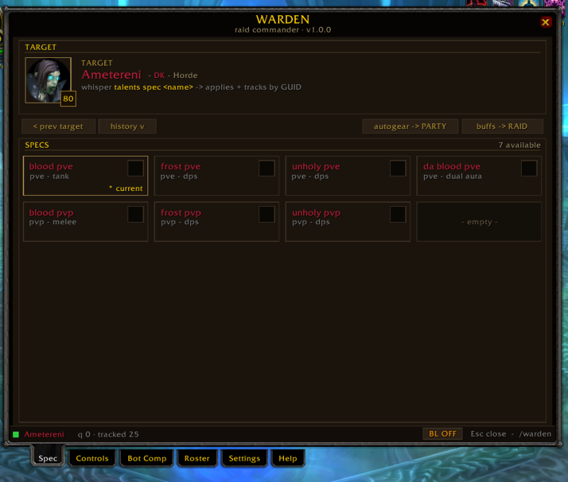
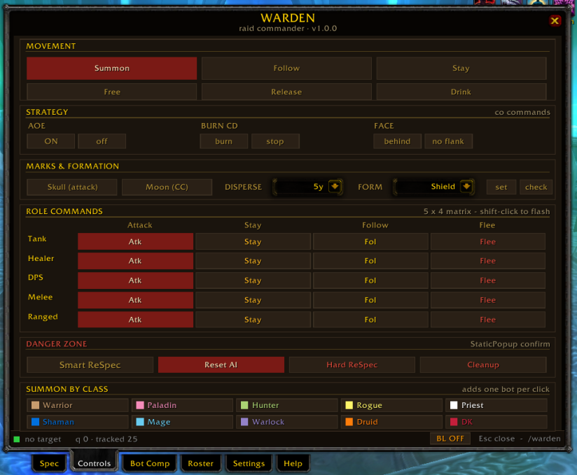
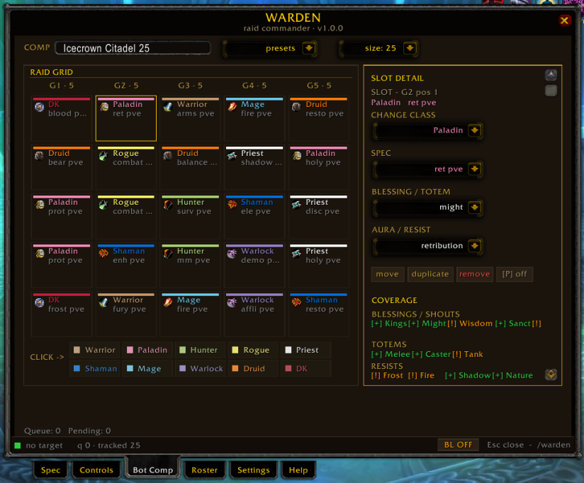
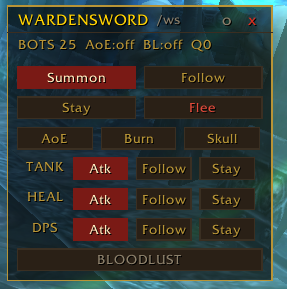
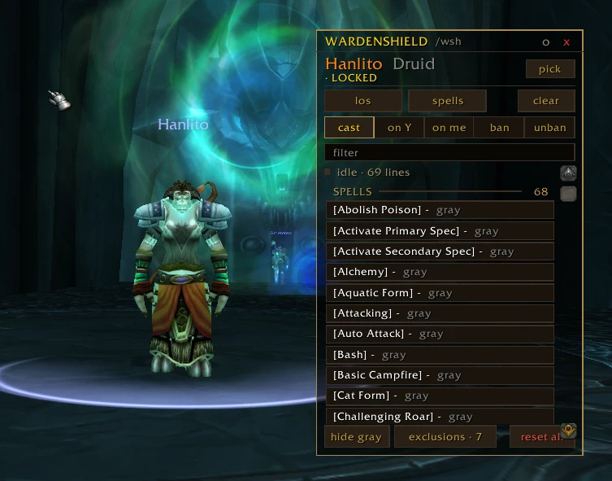
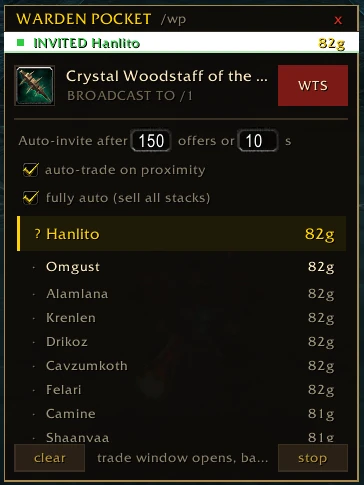
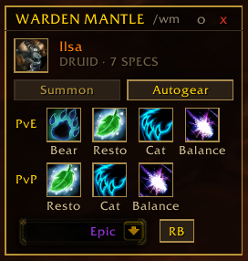

# Warden

**All-in-one raid commander for WoW 3.3.5a (WotLK) / WarStorm playerbots.**
Specs, bots, comp, roster & raid controls — all in one tabbed window, plus combat HUDs and a throttled whisper queue.

> ⚠️ **WarStorm only.** Warden is built exclusively for the **WarStorm** server (WoW 3.3.5a / WotLK, with `mod-playerbots` enabled). It relies on WarStorm's playerbot commands and **will not work** on retail, Classic, or any other private server.

<!-- BANNER: drop a wide screenshot/logo here once available

-->

---

## How this started

This wasn't planned at all.

I was just running raids with **WSSM** (Patchs / Valleriaa) for specs and **WarstormBotManager** (Moroes) for spawning and control. Solid setup — used it for a while.

At some point I thought: *"I've got a fancy Claude Code license from work… let's push WSSM a bit further."* So I started building what was basically **WSSM Extended** — improving flow, making things quicker, nothing huge at first.

Then, right when I was about to post it, I saw what **Runshouse** did with **OptimalRaidComposer + WBM Lite** 😅 — and it was clear this could go way further than what I was about to drop.

So instead of posting, I went back in and doubled down. More ideas, more polish, and honestly a stupid amount of tokens later… it turned into something much bigger.

That's how **Warden v1.0.0** happened. 👍

> If you want to fork it and take it further — go for it. That's pretty much how this whole thing started anyway.

---

## ✨ Features

### 🧭 Main Window — `/warden` (6 tabs)

**Spec**



- Click target → click spec → done
- Target history popup
- Auto gear / worldbuff buttons
- Recommended PvE spec highlight
- GUID tracking → reconnect = instant reapply

**Controls**



- Movement: Follow / Stay / Flee
- Strategy: AoE / Burn CD / Facing
- Marks + formation
- 5×4 role matrix (atk / stay / follow / flee)

**Danger Zone**
- Smart ReSpec
- Reset AI
- Hard ReSpec
- Cleanup (with confirmation)

**Extra**
- Quick summon by class buttons

**Bot Comp**



- Visual raid grid (5 / 10 / 25 / 40)
- Drag & drop setup
- Per slot: spec / blessings / totems / auras / resist (paladins can pick **Sanctuary** on any spec)
- **Coverage panel** — a raid-grid table of buff tiles that light green when provided and stay dim-red when missing, so gaps read at a glance
- Consolidated **action bar** along the bottom: FILE row (save / load / import / export / delete / clear / cleanup / rename) up top, and the **Build · Create · Stop Build** group with the live Queue/Pending status below
- `[P]` flag = real player (never touched)

**Roster**
- Live raid grouped: Tank / Healer / DPS
- Buff provider indicators per class
- ReSpec all or selected
- `[P]` toggle per row

**Settings**
- Auto behaviors
- Window sizes
- HUD config
- Maintenance tools (GUID, flags, presets)

**Help**
- Full in-game reference

### ⚔️ HUD — `/ws`



- Summon / Follow / Stay / Flee (2×2)
- Strategy row (AoE / Burn / Skull)
- Role matrix (Tank / Heal / DPS × actions)
- Full-width **BLOODLUST** (turns red when active)
- Draggable / lockable
- Auto show in combat
- Density presets + transparency

### 🛡️ WardenShield — `/wsh`



A floating **discovery & capture** panel for inspecting a single bot.

- Target a bot, hit `[pick]` to lock it
- `[los]` → list nearby usable objects · `[spells]` → list the bot's spellbook
- Whisper replies are captured for a few seconds and turned into **clickable rows**
- Click a row to act, based on the active mode:
  - `cast` — cast that spell / use that object
  - `on Y` — cast it on your next target · `on me` — cast it on yourself
  - `ban` / `unban` — add/remove the spell from the bot's exclude list (`ss +/-`)
- `hide gray` hides spells the bot can't actually use
- Persistent **exclusions** view to manage everything you've banned
- Player-flag guard — real players can never be picked

### 💰 WardenPocket — `/wp`



A hands-off **WTS auction** tool that sells to bot buyers for you.

- Drop an item in the slot → `[WTS]` broadcasts it to General chat
- Listens for whispered offers (`12g 21s` style) and **ranks bidders** highest-first
- **Auto-invites the winner** when bids go quiet, hit your offer cap, or the timer runs out
- Tunable: `Top` (max offers) and `Wait` (timeout seconds)
- Trade banner: set quantity → it whispers the exact total to the winner
- `[Stop]` freezes bidding, `[Clear]` resets and un-invites

### 🎽 WardenMantle — `/wm`



A small floating **spec-swap HUD** (successor to feysSpecManager) for whatever bot you're targeting — its core job is fast on-the-fly spec switching.

- **Target line** — portrait + class-colored name + spec count of the current target (or "No Target")
- **Spec tiles** — `PvE` and `PvP` rows of the target's specs (label sits inline to the left; icons stay a fixed size even for the druid's 4 PvE specs). Click a tile to whisper `talents spec <spec>` to that bot. The swap is recorded by GUID, so a Comp-tab Re-Spec re-applies it after a retarget
- **Summon** — whispers `summon` straight to the *targeted* bot, so that specific bot comes to you (not a party-wide call) · **Autogear** — runs the autogear pass on the party
- **Rarity + RB** — pick a gear rarity (Common / Uncommon / Rare / Epic), then hit **RB** (*Reset Bot* — hover for the full tooltip) to send `.warstormbot bot init=<rarity>`, re-rolling bot gear at that quality
- Draggable / lockable, position persists across `/reload`
- Mantle whispers fire **instantly** (un-throttled) — you drive it one bot at a time, so there's no flood risk. The mass build / Re-Spec paths stay throttled to respect the server's whisper mute

### 📋 Presets

- 11 built-in comps (Onyxia → ICC, 5 to 25 man)
- Fully editable / deletable
- Default presets can be restored anytime

### 🔄 Import / Export

- `WRDN2` strings
- Share full comps via Discord / in-game
- Lossless

### ⚙️ Under the hood

- Throttled whisper + spawn queue (no spam issues)
- GUID-based spec persistence
- Real player protection everywhere
- Auto party → raid
- Saves through reload / relog

### 🔇 Bot whisper filter

On WarStorm, playerbots whisper you an invite pitch every time you walk past one — `Invite me to your group first`, `I am in a full group. Will do it later`. Settings → **Block external bot invite whispers** silences exactly those lines.

- **Off by default** — opt in from the Global settings panel.
- **Targeted, not a blanket mute** — a whisper is hidden only when the sender is *not* in your party/raid **and** the text matches a known bot-invite line. A real player, or a bot already in your group, always gets through.
- The toggle carries an in-UI warning, since matching on whisper text could in theory catch an unwanted real whisper with that exact wording.

---

## 📦 Installation

1. **Close the game completely.**
2. Copy the entire **`Warden`** folder into your client:
   ```
   <WoW>\Interface\AddOns\Warden\
   ```
3. Launch the game and log in.
4. At the character-select screen, enable **"Load out-of-date AddOns"** (top-right AddOns button) — Warden targets Interface `30300` and most private-server launchers disable old addons by default.
5. In-game, type `/warden` (or `/wden`) to open the main window, or `/ws` for the HUD.

> Built for **WoW 3.3.5a (WotLK)** on **WarStorm** (mod-playerbots enabled).

### First launch checklist
- A minimap button appears at the bottom-left of the minimap ring — drag it anywhere around the ring.
- Your own character is **auto-flagged as a human player**, so none of the automation ever touches you.
- If you had a **WSSM** profile, your saved comps auto-migrate into the **Bot Comp** tab on first login.

## 🎮 Slash commands

**Main window**

| Command  | What it does            |
|----------|-------------------------|
| `/warden`| Toggle the main window  |
| `/wden`  | Same (alias)            |

**WardenSword HUD**

| Command          | What it does                    |
|------------------|---------------------------------|
| `/ws`            | Toggle the HUD                  |
| `/ws show \| hide` | Explicit show / hide          |
| `/ws lock \| unlock` | Lock or unlock position     |
| `/ws reset`      | Reset HUD position              |
| `/ws config`     | Jump to Settings → WardenSword  |
| `/ws help`       | Print the full command list     |

Direct HUD actions: `/ws summon · follow · stay · flee · aoe · burn · skull · bl`, plus role commands `/ws @tank|@heal|@dps atk|stay`.

**WardenShield**

| Command          | What it does                       |
|------------------|------------------------------------|
| `/wsh`           | Toggle the WardenShield panel      |
| `/wsh show \| hide` | Explicit show / hide            |
| `/wsh lock \| unlock` | Lock or unlock position        |
| `/wsh reset`     | Reset position                     |
| `/wsh clear`     | Wipe captured list + unlock target |
| `/wsh los`       | Fire `los` discovery on the target |
| `/wsh spells`    | Fire `spells` discovery on the target |
| `/wsh help`      | Print the command list             |

**WardenPocket**

| Command          | What it does                          |
|------------------|---------------------------------------|
| `/wp`            | Toggle the WardenPocket HUD           |
| `/wp show \| hide` | Explicit show / hide                |
| `/wp ItemName`   | Toggle + pre-fill the item name field |
| `/wardenpocket`  | Alias for `/wp`                       |

**WardenMantle**

| Command          | What it does                       |
|------------------|------------------------------------|
| `/wm`            | Toggle the WardenMantle HUD        |
| `/wm show \| hide` | Explicit show / hide             |
| `/wm lock \| unlock` | Lock or unlock position         |
| `/wm reset`      | Reset position                     |
| `/wm help`       | Print the command list             |

**Logging**

| Command              | What it does                         |
|----------------------|--------------------------------------|
| `/wardenlog on\|off` | Toggle INFO/WARN logging (errors always captured) |
| `/wardenlog status`  | Show ON/OFF state and entry count    |
| `/wardenlog tail N`  | Print the last N entries             |
| `/wardenlog all`     | Print the whole log                  |
| `/wardenlog clear`   | Wipe the log                         |

## ⌨️ Keybinds

Bindable under **ESC → Key Bindings → "Warden"**: toggle window, tab shortcuts, Summon / Follow / Stay / Tank-Attack / Flee, plus the full **WardenSword** action and role-command set (AoE, Burn CDs, Skull, BL, Tanks/Healers/DPS Attack/Stay), and **WardenMantle** toggle / lock. Every binding routes through the same throttled Engine queue, so hammering a hotkey never triggers a server-side mute.

## 🖱️ Minimap button

| Action        | Result                    |
|---------------|---------------------------|
| Left-click    | Toggle main window        |
| Shift-left    | Open Settings tab         |
| Middle-click  | Toggle WardenSword HUD     |
| Right-click   | Open Help tab             |
| Drag          | Orbit the minimap ring (saved per-character) |

## 🛠️ Troubleshooting

- **Addon doesn't load** → enable *"Load out-of-date AddOns"* at character select (Interface `30300`).
- **No minimap button** → `/warden` → Settings → Maintenance → *Reset minimap button*.
- **Bots never get spec'd after a party→raid convert** → the convert is gated on combat lockdown; leave combat and press **Build** again.
- **Server says "you are being ignored" during a Re-Spec** → raise the whisper interval: `/run WardenDB.interval = 0.60; ReloadUI()` (default `0.45s`).

> Warden persists everything to a single `WardenDB` table (logging uses `WardenLog` / `WardenLogEnabled`). It never reads or touches any other addon's SavedVariables or your account data.

---

## 🙏 Credits

Forked from **WSSM** (Patchs & Valleriaa), and merges ideas/code from:
- **WarstormBotManager** — Moroes
- **WBM Lite** & **OptimalRaidComposer** — Runshouse

Huge thanks to all of them — Warden stands on their work.

---

## 🐛 Feedback

If something feels off or breaks, just send what you were doing + any error message and I'll take a look. 👍

<!-- This README and the original announcement were written with AI — I'm massively dyslexic, and it helps me get things out without spending hours rewriting everything. -->
